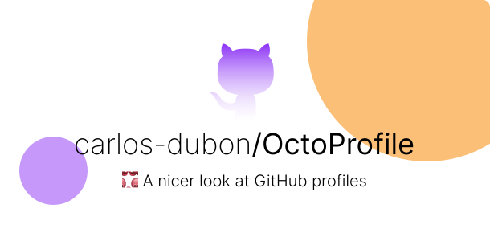
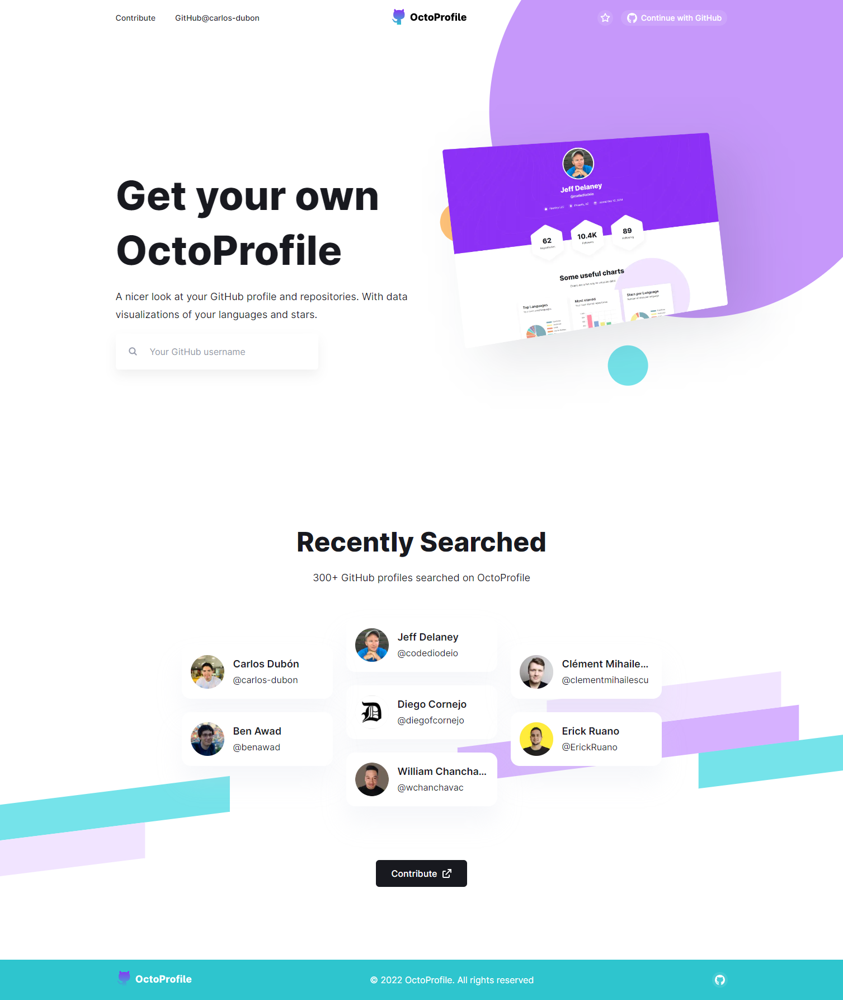
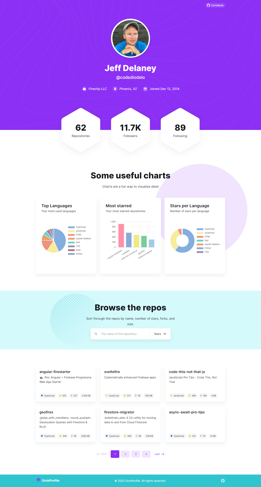

<p align="center">
  
</p>

<h3 align="center">
   <a href="https://myoctoprofile.vercel.app/">
 Project site
  </a>
</h3>

<p align="center">
  
  
  
  
</p>

## 📦 Packages

- ⚡️ [Next.js](https://nextjs.org/) - The React Framework for Production.
- ⚛️ [React.js](https://reactjs.org/) - A JavaScript library for building user interfaces.
- 💙 [TypeScript](https://www.typescriptlang.org/) - A superset of JavaScript.
- 💅 [Emotion](https://emotion.sh/docs/introduction) - A library designed for writing css styles with JavaScript.
- 📊 [Chart.js](https://www.chartjs.org/) - Simple yet flexible JavaScript charting for designers & developers.
- 🔥 [Firebase](https://firebase.google.com) - A platform developed by Google for creating mobile and web applications.
- 📝 [Formik](https://formik.org/) - The world's most popular open source form library for React.
- 🔃 [Axios](https://axios-http.com/) - Promise based HTTP client for the browser and Node.js.
- 🌐 [Redux](https://redux.js.org/) - An open-source JavaScript library for managing and centralizing application state.

## 🚀 Getting started

1. Clone the repository:

```bash
$ git@github.com:carlos-dubon/octoprofile.git
```

2. Install the dependencies:

```bash
$ yarn install
```

3. Run:

```bash
$ yarn dev
```

## 🔑 License

[MIT](./LICENSE)

## 📸 Screenshots




